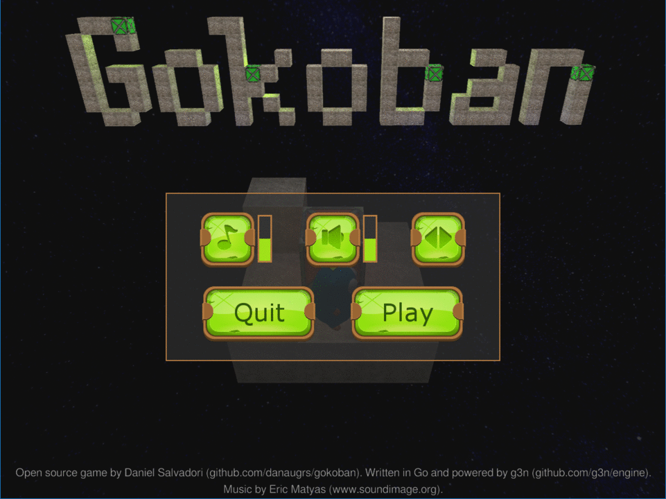

# ZenBox 3D - Relaxing 3D Puzzle Game
**Maintained by Muhammed Rihan**

ZenBox 3D is a minimalist 3D puzzle game where you control a gopher to solve logic-based challenges. Your objective in each level is to push the boxes until they are all on top of the yellow pads.

It features mechanical elevators and a dynamic 3D perspective to provide a fresh take on the classic Sokoban puzzle.



## Features
- **Relaxing Gameplay**: Designed with a Zen-like focus on logic and strategy.
- **3D Mechanics**: Rotate the camera to see the puzzle from any angle.
- **Vertical Challenges**: Use elevators to reach high places and move boxes between floors.

## Building from source

Make sure you have the [G3N external dependencies](https://github.com/g3n/engine#dependencies) in place. Then execute the following commands:

```bash
go build
./zenbox3d
```

## Credits
- **Maintainer**: Muhammed Rihan
- **Game Engine**: [G3N](https://github.com/g3n/engine)
- **Music**: Eric Matyas (www.soundimage.org)
